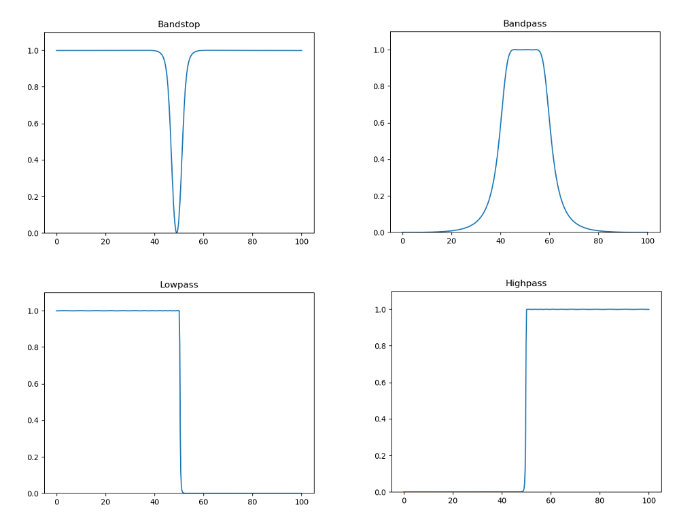
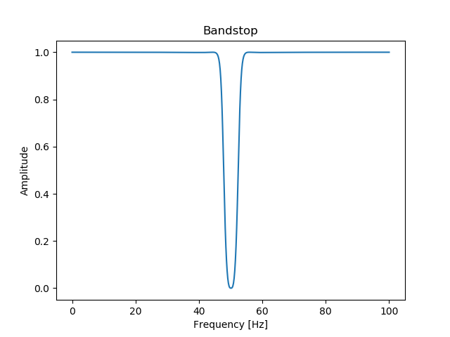

# IIR-filter
An IIR filter class implementation in Python.

This filter class is capable to do low/high/bandpass and stopband filterings with different filter designs: Butterworth or Chebyshev Type I/II.



This project was created as part of a university assignment.

The structure of this readme is heavily based on the [IIRJ filter class' readme structure by Bernd Porr](https://github.com/berndporr/iirj).

**Important note: you have to have the _numpy_ and _scipy_ libraries installed for the class to work!**<br />
(Use Python's package manager, pip, to install them.)

## Usage

`from IIR2Filter import IIR2Filter`

### Instantiation of the class

  `MyFilter = IIR2Filter(order,cutoff,filterType,design='butter',rp=1,rs=1,fs=0)`
  
  At the instantiation of the filter the following parameters are compulsory:
  - `order`:positive integer
      - It represents the order of the desired filter.
        Can be odd or even number, the filter will create a chain of second
        order filters and an extra first order one if necessary.
  - `cutoff`:array/positive float
      - Depending on the desired filter 1 cutoff frequency is to be 
        enetered as a positive float for low/highpass filters or
        2 cutoff frequenices to be entered in an array as positive floats
        for bandstop and bandpass filters. These cutoff frequencies can be
        either entered as normalised to the Nyquist frequency (1 =
        Nyquist frequency) or as Hz (0 < f < Nyquist), but in this case fs,
        the sampling frequency has to be passed too.
  - `filterType`:string
      - Options are: 'lowpass', 'highpass', 'bandpass' and 'bandstop'.
            
  The following paremeters are NON-compulsory:
  - `design`:string
      - Different types of coefficient generations
        can be chosen. The three available filters are Butterworth, 
        Chebyshev type 1 or type 2.
        The options are: 'butter', 'cheby1', 'cheby2'. If left unspecified the 
        default value is 'butter'.
  - `rp`:positive float    
      - Only necessary if cheby1 is chosen to be used. It defines the 
        maximum allowed passband ripples in decibels. If unspecified the
        default is 1.
  - `rs`:positive float    
      - Only necessary if cheby2 is chosen to be used. It defines the 
        minimum required stopband attenuation in decibels. If unspecified 
        the default is 1.
  - `fs`:positive float
      - The sampling frequency should only be specified if the cutoff 
        frequency(es) provided are not normalised to Nyquist already. 
        In that case the sampling frequency in Hz will be used to normalise 
        them.

### Filtering
Sample by sample for realtime processing:

```
myValueFiltered = MyFilter.filter(myValue)
```
Or if the signal has already been acquired and is stored in the array `mySignal`:

```
for i in range(len(mySignal)):
  mySignalFiltered[i] = MyFilter.filter(mySignal[i])
```

## Example program
The IIR-filter/src/test folder contains a noisy ECG signal and a pre-written program
that filters it. Place all three files (resting.dat, IIR2Filter.py and test.py)
in the same folder for it to work. For the test program to be able to 
present graphs install the _matplotlib_ library.

An example program that produces the impulse response and from that the frequency response of a 50Hz mains removal filter:

```python
import matplotlib.pyplot as plt
import numpy as np
from IIR2Filter import IIR2Filter

fs = 200
FilterMains = IIR2Filter(3,[45,55],'bandstop',design='cheby1',rp=0.01,fs=200)

impulse = np.zeros(1000)
impulse[0] = 1
impulseResponse = np.zeros(len(impulse))

for i in range(len(impulse)):
    impulseResponse[i] = FilterMains.filter(impulse[i])

# To obtain the frequency response from the impulse response the Fourier
# transform of the impulse response has to be taken. As it produces
# a mirrored frequency spectrum, it is enough to plot the first half of it.
freqResponse = np.fft.fft(impulseResponse)
freqResponse = abs(freqResponse[0:int(len(freqResponse)/2)])
xfF = np.linspace(0,fs/2,len(freqResponse))

plt.figure("Frequency Response")
plt.plot(xfF,np.real(freqResponse))
plt.xlabel("Frequency [Hz]")
plt.ylabel("Amplitude")
plt.title("Bandstop")
```
    
The above code produces this output:

<p align="center">
  
</p>
    

