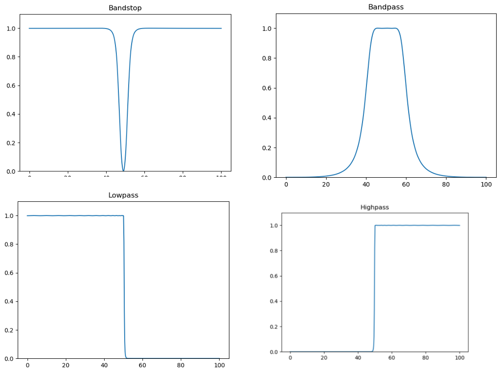

# IIR-filter
An IIR filter class implementation in Python

This filter class is capable to do low/high/bandpass and stopband filterings with different filter designs: Butterworth or Chebyshev Type I/II.

This project was created as part of a university assignment.
